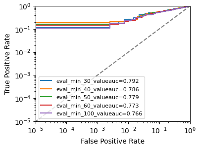

Result for finetune.py:
Fine-tuning on TOFU full set → ./output/tofu/Qwen1.5-0.5B/finetune
`torch_dtype` is deprecated! Use `dtype` instead!
Loading weights: 100% 291/291 [00:02<00:00, 112.09it/s, Materializing param=model.norm.weight]
The tied weights mapping and config for this model specifies to tie model.embed_tokens.weight to lm_head.weight, but both are present in the checkpoints, so we will NOT tie them. You should update the config with `tie_word_embeddings=False` to silence this warning
Train samples: 4000
warmup_ratio is deprecated and will be removed in v5.2. Use `warmup_steps` instead.
{'loss': '2.731', 'grad_norm': '23.36', 'learning_rate': '2e-05', 'epoch': '0.04'}
{'loss': '2.291', 'grad_norm': '24.65', 'learning_rate': '1.992e-05', 'epoch': '0.08'}
{'loss': '2.183', 'grad_norm': '14.88', 'learning_rate': '1.966e-05', 'epoch': '0.12'}
{'loss': '2.071', 'grad_norm': '14.62', 'learning_rate': '1.925e-05', 'epoch': '0.16'}
{'loss': '1.964', 'grad_norm': '11.82', 'learning_rate': '1.868e-05', 'epoch': '0.2'}
{'loss': '1.861', 'grad_norm': '14.55', 'learning_rate': '1.797e-05', 'epoch': '0.24'}
{'loss': '1.87', 'grad_norm': '12.43', 'learning_rate': '1.712e-05', 'epoch': '0.28'}
{'loss': '1.897', 'grad_norm': '11.94', 'learning_rate': '1.615e-05', 'epoch': '0.32'}
{'loss': '1.813', 'grad_norm': '15.83', 'learning_rate': '1.507e-05', 'epoch': '0.36'}
{'loss': '1.797', 'grad_norm': '15.84', 'learning_rate': '1.392e-05', 'epoch': '0.4'}
{'loss': '1.834', 'grad_norm': '12.55', 'learning_rate': '1.269e-05', 'epoch': '0.44'}
{'loss': '1.805', 'grad_norm': '13.23', 'learning_rate': '1.142e-05', 'epoch': '0.48'}
{'loss': '1.748', 'grad_norm': '11.31', 'learning_rate': '1.013e-05', 'epoch': '0.52'}
{'loss': '1.768', 'grad_norm': '12.01', 'learning_rate': '8.834e-06', 'epoch': '0.56'}
{'loss': '1.753', 'grad_norm': '15.07', 'learning_rate': '7.558e-06', 'epoch': '0.6'}
{'loss': '1.761', 'grad_norm': '12.33', 'learning_rate': '6.324e-06', 'epoch': '0.64'}
{'loss': '1.711', 'grad_norm': '13.17', 'learning_rate': '5.151e-06', 'epoch': '0.68'}
{'loss': '1.745', 'grad_norm': '13.66', 'learning_rate': '4.059e-06', 'epoch': '0.72'}
{'loss': '1.725', 'grad_norm': '12.31', 'learning_rate': '3.068e-06', 'epoch': '0.76'}
{'loss': '1.728', 'grad_norm': '11.49', 'learning_rate': '2.193e-06', 'epoch': '0.8'}
{'loss': '1.694', 'grad_norm': '11.1', 'learning_rate': '1.45e-06', 'epoch': '0.84'}
{'loss': '1.619', 'grad_norm': '12.23', 'learning_rate': '8.505e-07', 'epoch': '0.88'}
{'loss': '1.67', 'grad_norm': '10.41', 'learning_rate': '4.051e-07', 'epoch': '0.92'}
{'loss': '1.674', 'grad_norm': '10.87', 'learning_rate': '1.211e-07', 'epoch': '0.96'}
{'loss': '1.76', 'grad_norm': '14.44', 'learning_rate': '3.37e-09', 'epoch': '1'}
100% 125/125 [08:07<00:00,  3.88s/it]
Writing model shards:   0% 0/1 [00:00<?, ?it/s]
Writing model shards: 100% 1/1 [01:00<00:00, 60.74s/it]
{'train_runtime': '769.4', 'train_samples_per_second': '5.199', 'train_steps_per_second': '0.162', 'train_loss': '1.859', 'epoch': '1'}
100% 125/125 [12:49<00:00,  6.16s/it]
Writing model shards: 100% 1/1 [02:47<00:00, 167.97s/it]
Fine-tuned model saved to ./output/tofu/Qwen1.5-0.5B/finetune

Result for unlearn.py:
wandb: WARNING The anonymous parameter to wandb.login() has no effect and will be removed in future versions.
wandb: WARNING Unable to verify login in offline mode.
ccwandb: Tracking run with wandb version 0.25.1
wandb: W&B syncing is set to `offline` in this directory. Run `wandb online` or set WANDB_MODE=online to enable cloud syncing.
wandb: Run data is saved locally in /content/unlearn-plm/wandb/offline-run-XXXXXXXXXXXXXXXXXXXXXXX
INFO:__main__:Method: gradient_ascent | Domain: tofu
INFO:__main__:Output: ./output/tofu/finetune/1_gpu_bs_1_gas_32_lr_1.0e_5_epoch1/unlearn/gradient_ascent
loading configuration file ./output/tofu/Qwen1.5-0.5B/finetune/config.json
`torch_dtype` is deprecated! Use `dtype` instead!
Model config Qwen2Config {
  "architectures": [
    "Qwen2ForCausalLM"
  ],
  "attention_dropout": 0.0,
  "bos_token_id": 151643,
  "dtype": "float32",
  "eos_token_id": 151643,
  "hidden_act": "silu",
  "hidden_size": 1024,
  "initializer_range": 0.02,
  "intermediate_size": 2816,
  "layer_types": [
    "full_attention",
    "full_attention",
    "full_attention",
    "full_attention",
    "full_attention",
    "full_attention",
    "full_attention",
    "full_attention",
    "full_attention",
    "full_attention",
    "full_attention",
    "full_attention",
    "full_attention",
    "full_attention",
    "full_attention",
    "full_attention",
    "full_attention",
    "full_attention",
    "full_attention",
    "full_attention",
    "full_attention",
    "full_attention",
    "full_attention",
    "full_attention"
  ],
  "max_position_embeddings": 32768,
  "max_window_layers": 21,
  "model_type": "qwen2",
  "num_attention_heads": 16,
  "num_hidden_layers": 24,
  "num_key_value_heads": 16,
  "pad_token_id": null,
  "rms_norm_eps": 1e-06,
  "rope_parameters": {
    "rope_theta": 1000000.0,
    "rope_type": "default"
  },
  "sliding_window": null,
  "tie_word_embeddings": true,
  "transformers_version": "5.0.0",
  "use_cache": false,
  "use_sliding_window": false,
  "vocab_size": 151936
}

loading weights file ./output/tofu/Qwen1.5-0.5B/finetune/model.safetensors
Generate config GenerationConfig {
  "bos_token_id": 151643,
  "eos_token_id": 151643,
  "output_attentions": false,
  "output_hidden_states": false,
  "use_cache": false
}

Loading weights: 100% 291/291 [00:00<00:00, 750.16it/s, Materializing param=model.norm.weight]
The tied weights mapping and config for this model specifies to tie model.embed_tokens.weight to lm_head.weight, but both are present in the checkpoints, so we will NOT tie them. You should update the config with `tie_word_embeddings=False` to silence this warning
loading configuration file ./output/tofu/Qwen1.5-0.5B/finetune/generation_config.json
Generate config GenerationConfig {
  "bos_token_id": 151643,
  "do_sample": false,
  "eos_token_id": 151643,
  "max_new_tokens": 2048
}

Could not locate the custom_generate/generate.py inside ./output/tofu/Qwen1.5-0.5B/finetune.
loading configuration file ./output/tofu/Qwen1.5-0.5B/finetune/config.json
Model config Qwen2Config {
  "architectures": [
    "Qwen2ForCausalLM"
  ],
  "attention_dropout": 0.0,
  "bos_token_id": 151643,
  "dtype": "float32",
  "eos_token_id": 151643,
  "hidden_act": "silu",
  "hidden_size": 1024,
  "initializer_range": 0.02,
  "intermediate_size": 2816,
  "layer_types": [
    "full_attention",
    "full_attention",
    "full_attention",
    "full_attention",
    "full_attention",
    "full_attention",
    "full_attention",
    "full_attention",
    "full_attention",
    "full_attention",
    "full_attention",
    "full_attention",
    "full_attention",
    "full_attention",
    "full_attention",
    "full_attention",
    "full_attention",
    "full_attention",
    "full_attention",
    "full_attention",
    "full_attention",
    "full_attention",
    "full_attention",
    "full_attention"
  ],
  "max_position_embeddings": 32768,
  "max_window_layers": 21,
  "model_type": "qwen2",
  "num_attention_heads": 16,
  "num_hidden_layers": 24,
  "num_key_value_heads": 16,
  "pad_token_id": null,
  "rms_norm_eps": 1e-06,
  "rope_parameters": {
    "rope_theta": 1000000.0,
    "rope_type": "default"
  },
  "sliding_window": null,
  "tie_word_embeddings": true,
  "transformers_version": "5.0.0",
  "use_cache": false,
  "use_sliding_window": false,
  "vocab_size": 151936
}

Could not locate the tokenizer configuration file, will try to use the model config instead.
INFO:__main__:Starting unlearning with method=gradient_ascent on domain=tofu
Model vocab: 151936
Max token id: 151643
***** Running training *****
  Num examples = 400
  Num Epochs = 1
  Instantaneous batch size per device = 1
  Total train batch size (w. parallel, distributed & accumulation) = 32
  Gradient Accumulation steps = 32
  Total optimization steps = 13
  Number of trainable parameters = 619,570,176
100% 13/13 [01:38<00:00,  6.79s/it]

Training completed. Do not forget to share your model on huggingface.co/models =
{'train_runtime': '98.37', 'train_samples_per_second': '4.066', 'train_steps_per_second': '0.132', 'train_loss': '-59.87', 'epoch': '1'}
100% 13/13 [01:38<00:00,  7.57s/it]
INFO:__main__:Unlearning done in 0h 1m 38.7s
Saving model checkpoint to ./output/tofu/finetune/1_gpu_bs_1_gas_32_lr_1.0e_5_epoch1/unlearn/gradient_ascent
Configuration saved in ./output/tofu/finetune/1_gpu_bs_1_gas_32_lr_1.0e_5_epoch1/unlearn/gradient_ascent/config.json
Configuration saved in ./output/tofu/finetune/1_gpu_bs_1_gas_32_lr_1.0e_5_epoch1/unlearn/gradient_ascent/generation_config.json
Writing model shards: 100% 1/1 [02:32<00:00, 152.06s/it]
Model weights saved in ./output/tofu/finetune/1_gpu_bs_1_gas_32_lr_1.0e_5_epoch1/unlearn/gradient_ascent/model.safetensors
***** train metrics *****
  epoch                    =        1.0
  total_flos               =   265495GF
  train_loss               =   -59.8708
  train_runtime            = 0:01:38.36
  train_samples            =        400
  train_samples_per_second =      4.066
  train_steps_per_second   =      0.132
INFO:__main__:Model saved to ./output/tofu/finetune/1_gpu_bs_1_gas_32_lr_1.0e_5_epoch1/unlearn/gradient_ascent

Result for eval.py:
Loading weights: 100% 291/291 [00:00<00:00, 784.98it/s, Materializing param=model.norm.weight]
The tied weights mapping and config for this model specifies to tie model.embed_tokens.weight to lm_head.weight, but both are present in the checkpoints, so we will NOT tie them. You should update the config with `tie_word_embeddings=False` to silence this warning
2026-04-15 14:51:43,557 - INFO - __main__ - *** Evaluate ***
100% 400/400 [00:30<00:00, 13.13it/s]
***** forget_eval metrics *****
  eval_acc                    =    52.6146
  eval_loss                   =     2.6004
  eval_model_preparation_time =     0.0038
  eval_ppl                    =    14.2199
  eval_runtime                = 0:00:30.86
  eval_samples                =        400
  eval_samples_per_second     =     12.959
  eval_steps_per_second       =     12.959
  perplexity                  =    13.4695
100% 3600/3600 [04:59<00:00, 12.04it/s]
***** retain_eval metrics *****
  eval_acc                    =    57.5116
  eval_loss                   =     1.9667
  eval_model_preparation_time =     0.0038
  eval_ppl                    =     7.4658
  eval_runtime                = 0:04:59.16
  eval_samples                =       3600
  eval_samples_per_second     =     12.033
  eval_steps_per_second       =     12.033
  perplexity                  =      7.147

===== Evaluation Summary =====
  [forget]  ppl=13.47  loss=2.6004
  [retain]  ppl=7.15  loss=1.9667
==============================

Result for Membership Inference Attack:
Loading weights: 100% 291/291 [00:00<00:00, 797.66it/s, Materializing param=model.norm.weight]
The tied weights mapping and config for this model specifies to tie model.embed_tokens.weight to lm_head.weight, but both are present in the checkpoints, so we will NOT tie them. You should update the config with `tie_word_embeddings=False` to silence this warning
INFO:__main__:*** Membership Inference Attack Evaluation ***
100% 400/400 [00:31<00:00, 12.72it/s]
100% 400/400 [00:32<00:00, 12.24it/s]
output_dir ./output/tofu/mia
Attack eval_min_30_value   AUC 0.7919, Accuracy 0.7412, TPR@5%FPR of 0.4950

Attack eval_min_40_value   AUC 0.7860, Accuracy 0.7338, TPR@5%FPR of 0.4650

Attack eval_min_50_value   AUC 0.7789, Accuracy 0.7288, TPR@5%FPR of 0.4600

Attack eval_min_60_value   AUC 0.7730, Accuracy 0.7312, TPR@5%FPR of 0.4250

Attack eval_min_100_value   AUC 0.7660, Accuracy 0.7225, TPR@5%FPR of 0.4175

INFO:__main__:MIA results saved to ./output/tofu/mia/auc.txt and auc.png

MORE RESULTS:-
=== /content/unlearn-plm/output/tofu/eval/forget_eval_results.json ===
{
  "eval_acc": 52.61457061767578,
  "eval_loss": 2.600425958633423,
  "eval_model_preparation_time": 0.0038,
  "eval_ppl": 14.219943046569824,
  "eval_runtime": 30.8659,
  "eval_samples": 400,
  "eval_samples_per_second": 12.959,
  "eval_steps_per_second": 12.959,
  "perplexity": 13.469474252064702
}

=== /content/unlearn-plm/output/tofu/eval/retain_eval_results.json ===
{
  "eval_acc": 57.511566162109375,
  "eval_loss": 1.966689944267273,
  "eval_model_preparation_time": 0.0038,
  "eval_ppl": 7.465789318084717,
  "eval_runtime": 299.1697,
  "eval_samples": 3600,
  "eval_samples_per_second": 12.033,
  "eval_steps_per_second": 12.033,
  "perplexity": 7.146980388869251
}

=== /content/unlearn-plm/output/tofu/eval/all_results.json ===
{
  "eval_acc": 57.511566162109375,
  "eval_loss": 1.966689944267273,
  "eval_model_preparation_time": 0.0038,
  "eval_ppl": 7.465789318084717,
  "eval_runtime": 299.1697,
  "eval_samples": 3600,
  "eval_samples_per_second": 12.033,
  "eval_steps_per_second": 12.033,
  "perplexity": 7.146980388869251
}

=== MIA AUC ===
eval_min_30_value   AUC 0.7919, Accuracy 0.7412, TPR@0.1%FPR of 0.4950
eval_min_40_value   AUC 0.7860, Accuracy 0.7338, TPR@0.1%FPR of 0.4650
eval_min_50_value   AUC 0.7789, Accuracy 0.7288, TPR@0.1%FPR of 0.4600
eval_min_60_value   AUC 0.7730, Accuracy 0.7312, TPR@0.1%FPR of 0.4250
eval_min_100_value   AUC 0.7660, Accuracy 0.7225, TPR@0.1%FPR of 0.4175

=== MIA ROC Curve ===
